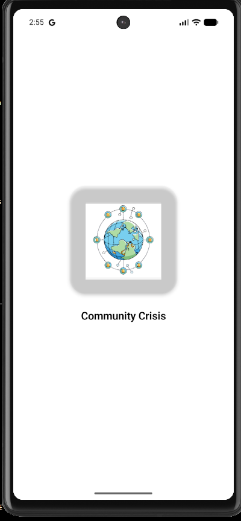
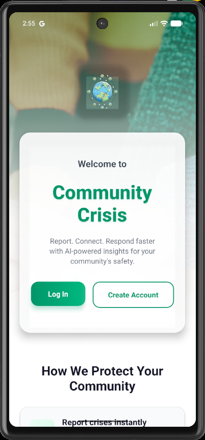
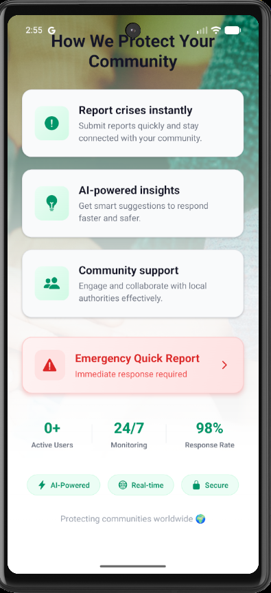
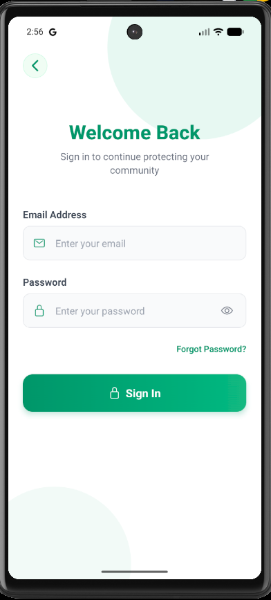
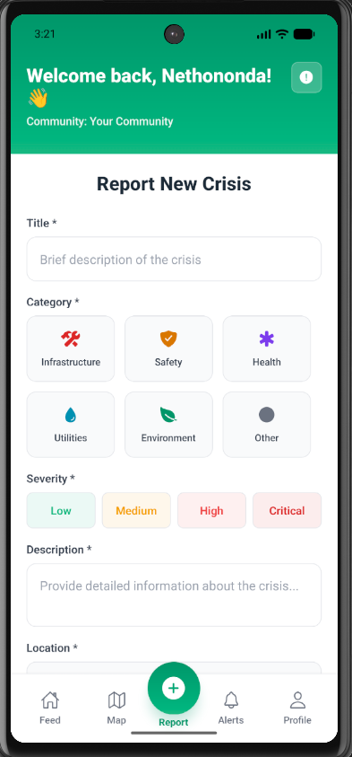
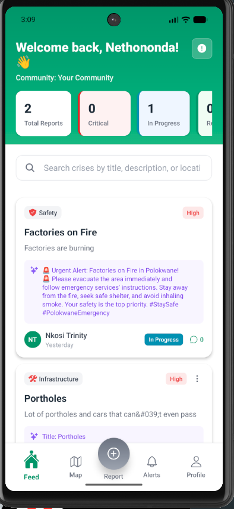
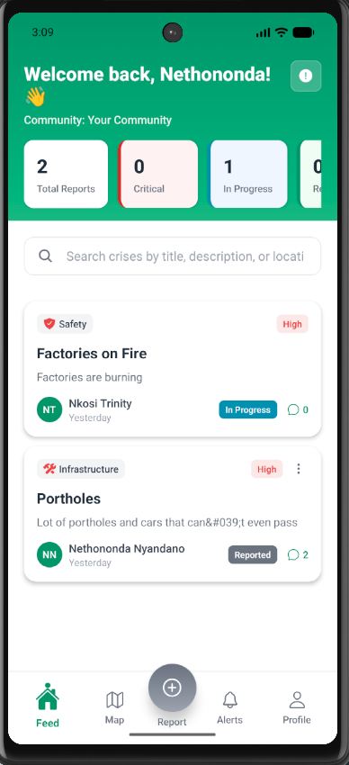
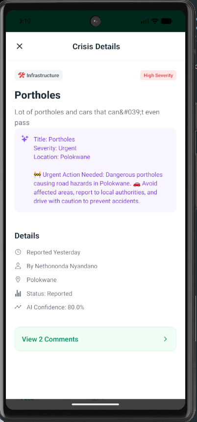
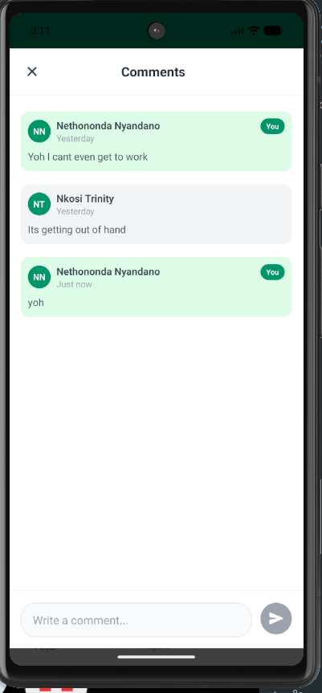

# AI-Powered Community Crisis Reporting Mobile App

          

**AI-Powered Community Crisis App** is a **mobile application** that allows users to report, view, and engage with community crises in real-time.  

- **Frontend:** React Native (TypeScript + CSS)  
- **Backend:** PHP (separate repository)  
- **API Calls:** Fetch API  
- **AI:** OpenAI for personalized suggestions and classification  
- **Database:** MySQL (handled in backend)  

> Note: The backend is maintained in a separate GitHub repository. Make sure to connect the mobile app to the backend API.

---

## Table of Contents

- [Features](#features)
- [Technology Stack](#technology-stack)
- [Screenshots](#screenshots)
- [Installation Guide](#installation-guide)
- [AI Components](#ai-components)
- [Future Enhancements](#future-enhancements)
- [Author](#author)

---

## Features

### User Features
- **Report a Crisis:** Submit incidents with title, description, severity, and location.  
- **AI Suggestions:** For every report, the app provides **real-time AI recommendations** on what actions users can take immediately.  
- **Community Feed:** View all reported crises from other users.  
- **Comment on Reports:** Engage with posts to provide suggestions or ask questions.  
- **Map Visualization:** All reported crises are displayed on a map with severity-based markers. Users and officials can quickly see locations and assess situations.  
- **AI Classification:** Reports are automatically categorized into Infrastructure, Safety, Health, or Utilities using **OpenAI**.  

### Official Features
- **Map Dashboard:** View all crises with location markers.  
- **Filter & Prioritize:** Sort incidents by type, severity, or time.  
- **Route Planning:** Generate shortest, fastest, or alternative routes to incidents.  
- **Update Status:** Mark incidents as In Progress, Resolved, or Dismissed.  

---

## Technology Stack


- **Frontend:** React Native + TypeScript + CSS  
- **Backend:** PHP (separate repo)  
- **API Requests:** Fetch API  
- **AI Module:** OpenAI API for classification, suggestions, and sentiment analysis  
- **Database:** MySQL (handled in backend)  

---

## Screenshots


| Login | Report Crisis | AI Suggestions | 
|--------------|---------------|----------------|
  |  |  | 
|Community Feed  | Report View    | Map View | Commenting | 
|----------------|----------------|----------|------------| 
|  |  |  |  |

---

## Installation Guide (Mobile App)

### 1. Clone the frontend repository
```bash
git clone https://github.com/yourusername/community-crisis-mobile.git
cd community-crisis-mobile


